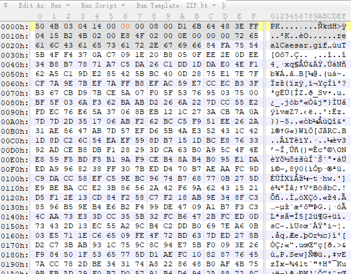

## `FILE EXT`

|   ext  |   head   |
|:-------|---------:|
JPEG (jpg)| FFD8FF
PNG (png) | 89504E47
GIF (gif) | 47494638
TIFF (tif) | 49492A00
Windows Bitmap (bmp) | 424D
CAD (dwg) | 41433130
Adobe Photoshop (psd) | 38425053
Rich Text Format (rtf) | 7B5C727466
XML (xml) | 3C3F786D6C
HTML (html) | 68746D6C3E
Email [thorough only] (eml) | 44656C69766572792D646174653A
Outlook Express (dbx) | CFAD12FEC5FD746F
Outlook (pst) | 2142444E
MS Word/Excel (xls.or.doc) | D0CF11E0
MS Access (mdb) | 5374616E64617264204A
WordPerfect (wpd) | FF575043
Postscript (eps.or.ps) | 252150532D41646F6265
Adobe Acrobat (pdf) | 255044462D312E
Quicken (qdf) | AC9EBD8F
Windows Password (pwl) | E3828596
ZIP Archive (zip) | 504B0304
RAR Archive (rar) | 52617221
Wave (wav) | 57415645
AVI (avi) | 41564920
Real Audio (ram) | 2E7261FD
Real Media (rm) | 2E524D46
MPEG (mpg) | 000001BA
MPEG (mpg) | 000001B3
Quicktime (mov) | 6D6F6F76
Windows Media (asf) | 3026B2758E66CF11
MIDI (mid) | 4D546864

## `ZIP`

### `压缩源文件数据区`
- 50 4B 03 04 -> 头文件标记
- 00 00 -> 无全局加密 | 00 09 -> 有全局加密
- 08 00 -> 压缩方式
- 5A 7E -> 最后修改文件时间
- F7 46 -> 最后修改文件日期
- 16 B5 80 14 -> CRC-32校验（1480B516）
- 19 00 00 00 -> 压缩后尺寸（25）
- 17 00 00 00 -> 未压缩尺寸（23）
- 07 00 -> 文件名长度
- 00 00 -> 扩展记录长度
### `压缩源文件目录区`
- 50 4B 01 02 -> 目录中文件文件头标记
- 3F 00 -> 压缩使用的 pkware 版本
- 14 00 -> 解压文件所需 pkware 版本
- 00 00 -> 全局方式位标记
- 08 00 -> 压缩方式
- 5A 7E -> 最后修改文件时间
- F7 46 -> 最后修改文件日期
- 16 B5 80 14 -> CRC-32校验（1480B516）
- 19 00 00 00 -> 压缩后尺寸（25）
- 17 00 00 00 -> 未压缩尺寸（23）
- 07 00 -> 文件名长度
- 24 00 -> 扩展字段长度
- 00 00 -> 文件注释长度
- 00 00 -> 磁盘开始号
- 00 00 -> 内部文件属性
- 20 00 00 00 -> 外部文件属性
- 00 00 00 00 -> 局部头部偏移量
### `压缩源文件目录结束`
- 50 4B 05 06 -> 目录结束标记
- 00 00 -> 当前磁盘编号
- 00 00 -> 目录区开始磁盘编号
- 01 00 -> 本磁盘上纪录总数
- 01 00 -> 目录区中纪录总数
- 59 00 00 00 -> 目录区尺寸大小
- 3E 00 00 00 -> 目录区对第一张磁盘的偏移量
- 00 00 1A -> ZIP 文件注释长度

## `s`
